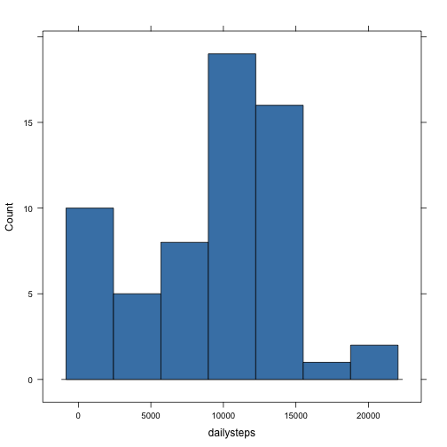
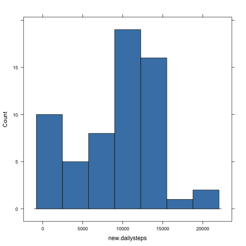

<span style="color:blue">
This is the R Markdown document for Reproducible Research Peer Assessment 1.
</span>

### Loading and preprocessing the data

```r
setwd("~/DS Toolbox/Github/RepData_PeerAssessment1")
activity <- read.csv("activity.csv")  # read file
```

### What is mean total number of steps taken per day?
1. Histogram with number of steps for each day

```r
dailysteps <- tapply(activity$steps, activity$date, sum, na.rm=TRUE)  # calculate daily steps
library(lattice)
histogram(dailysteps, type="count", breaks=length(dailysteps), col="steelblue")  # generate histogram
```

 

2. **mean** and **median** total number of steps taken per day

```r
mean(dailysteps)  # mean
```

```
## [1] 9354
```

```r
median(dailysteps)  # median
```

```
## [1] 10395
```

### What is the average daily activity pattern?
1. Time-series plot of the 5-minute interval and average number of steps taken

```r
intervalsteps <- sapply(split(activity$steps, activity$interval)
                            , mean, na.rm=TRUE)  # 5 min interval avg
library(ggplot2)
qplot(as.numeric(names(intervalsteps)), intervalsteps
            , geom="line", xlab="Time of Day HHMM", ylab="Average Steps")  # generate plot
```

 

2. Identify the 5-min interval that contains the maximum number of steps

```r
moststeps <- order(intervalsteps, decreasing=TRUE)  # daily average in decreasing order
intervalsteps[moststeps[1]]  # interval with maximum number of steps
```

```
##   835 
## 206.2
```

### Inputting missing values
1. Total number of missing values in the dataset

```r
sum(is.na(activity$steps))
```

```
## [1] 2304
```
2. Creating a strategy to fill-in missing values in the dataset

```r
# filler function -- 10% of average of each day; if not available, '5'
filler <- function(x) {
            if (is.nan(mean(x, na.rm=TRUE)))  5
            else mean(x, na.rm=TRUE)/10
}
dailymean <- tapply(activity$steps, activity$date, filler)
```
3. New dataset copied from the original, but with missing values filled-in

```r
newactivity <- activity
# fetch array of dates and values corresponding to NA steps and apply to missing values
newactivity <- within(newactivity
                        , steps[is.na(steps)] <- dailymean[newactivity$date[is.na(newactivity$steps)]])
```
4. 3-parts
* Histogram of new total steps per day

```r
new.dailysteps <- tapply(newactivity$steps, newactivity$date, sum, na.rm=TRUE)  # calculate daily steps
histogram(new.dailysteps, type="count", breaks=length(new.dailysteps), col="steelblue")
```

 

* Compare mean and median against previously calculated values


```r
c(old.mean = mean(new.dailysteps), new.mean = mean(dailysteps)
    , old.median = median(new.dailysteps), new.median = median(dailysteps))
```

```
##   old.mean   new.mean old.median new.median 
##       9543       9354      10395      10395
```

<span style="color:blue">
Interesting results - mean has increased, but median remains the same!
</span>

### Are there differences in activity patterns between weekdays and weekends?
1. Add a new column indicating whether a given date is weekday or weekend

```r
library(lubridate)
newactivity$dayofweek <- ifelse (wday(as.Date(newactivity$date, "%Y-%m-%d")) %in% c(1, 7)
                                 , yes="weekend", no="weekday")  # add new column day of week
detach(package:lubridate)
newactivity$dayofweek <- factor(newactivity$dayofweek)
newactivity[c(100, 300, 1600), ]
```

```
##      steps       date interval dayofweek
## 100      5 2012-10-01      815   weekday
## 300      0 2012-10-02       55   weekday
## 1600   511 2012-10-06     1315   weekend
```
2. Create a panel plot

```r
library(plyr)
dayOfWeekAvg <- ddply(newactivity, .(dayofweek, interval)
                        , summarize, avgsteps=mean(steps))  # determine if a date is weekday or weekend
baseplot <- qplot(interval, avgsteps, data=dayOfWeekAvg, facets=dayofweek ~ .
        , geom="line", xlab = "Interval", ylab = "Number of Steps")  # create plot elements
baseplot + geom_line(colour="blue") + theme_bw()
```

 
